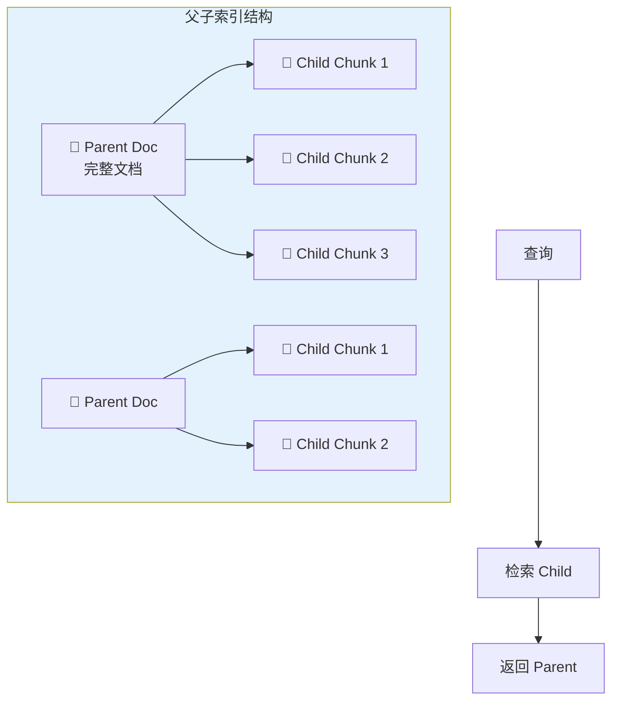
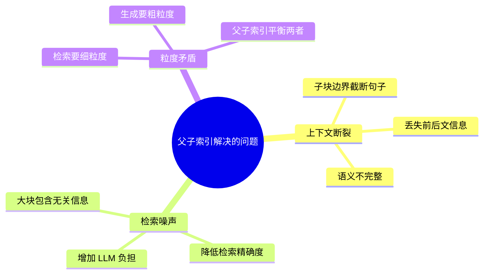
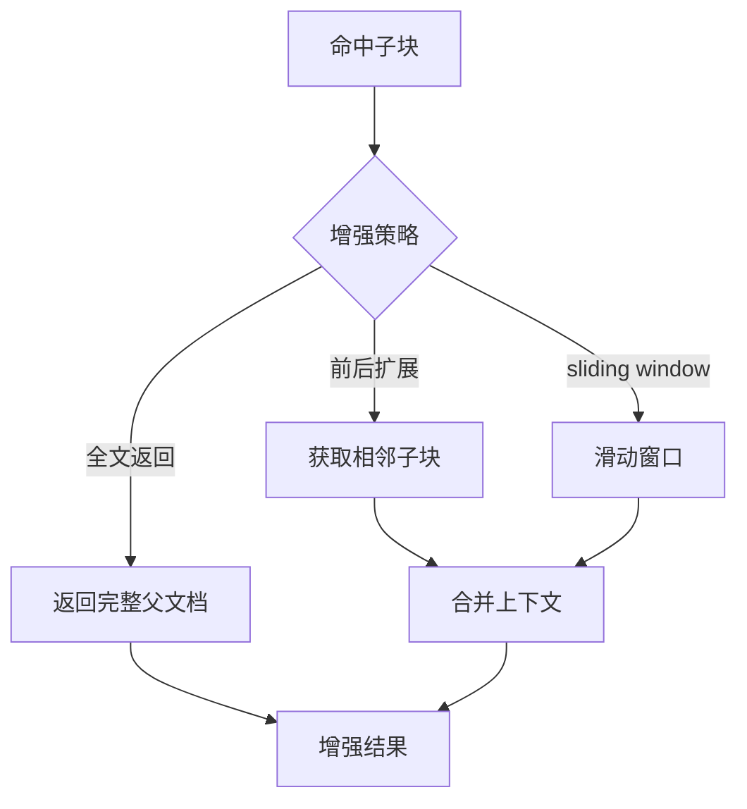
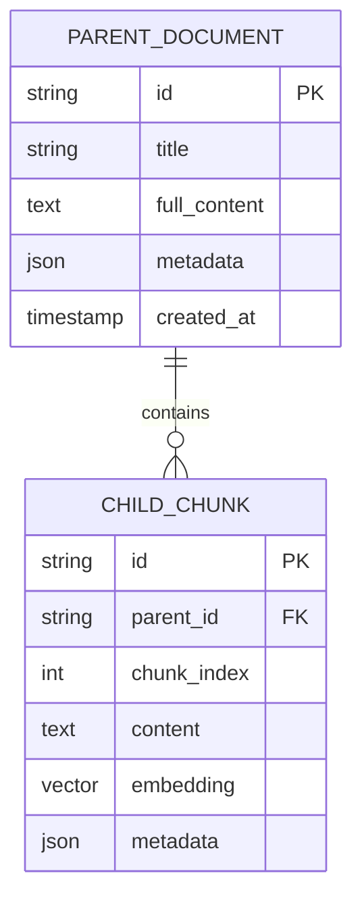

# 父子索引（Parent-Child Index）

## 一、概念与原理

### 1.1 什么是父子索引？

**父子索引**是一种分层索引结构：
- **Parent（父文档）**：完整的原始文档
- **Child（子块）**：文档切分后的小块，用于检索



**核心思想：**
- **检索粒度**：小块（Child）—— 提高精确度
- **返回粒度**：大块（Parent）—— 保证上下文完整

---

## 二、为什么要用父子索引？

### 2.1 纯小块 vs 纯大块 vs 父子索引

| 方案 | 检索精确度 | 上下文完整 | 适用场景 |
|------|-----------|-----------|---------|
| **纯小块** | ✅ 高 | ❌ 易断裂 | 短文档 |
| **纯大块** | ❌ 低 | ✅ 完整 | 超长文档需摘要 |
| **父子索引** | ✅ 高 | ✅ 完整 | 通用最佳 |

### 2.2 解决的问题



---

## 三、面试题详解

### 题目 1：父子索引中子块多大合适？重叠多少？

#### 考察点
- 分块策略设计
- 工程实践经验

#### 详细解答

**子块大小选择：**

```mermaid
xychart-beta
    title "块大小对检索效果的影响"
    x-axis [100, 200, 300, 500, 800, 1000]
    y-axis "效果分数" 0 --> 100
    
    line "检索精确度" : [60, 75, 85, 90, 85, 80]
    line "上下文完整" : [40, 55, 70, 85, 92, 95]
    line "综合效果" : [50, 65, 78, 88, 89, 88]
```

**推荐配置：**

| 文档类型 | 块大小 | 重叠 | 原因 |
|----------|--------|------|------|
| 代码 | 200-300 | 50 | 函数/类边界重要 |
| 论文 | 300-500 | 100 | 段落完整 |
| 对话 | 150-250 | 30 | 上下文依赖强 |
| 法律 | 400-600 | 150 | 条款完整 |

**重叠的作用：**

```java
// 重叠确保语义连续性
Chunk 1: "...今天天气很好。我们出去..."
Chunk 2: "...我们出去散步。然后..."
         ↑ 重叠区域保证"我们出去"不被截断
```

---

### 题目 2：父子索引如何实现上下文增强？

#### 考察点
- 高级检索策略
- 上下文组装

#### 详细解答

**上下文增强策略：**



**Java 实现：**

```java
/**
 * 上下文增强检索
 */
public class ContextualRetrievalService {
    
    private final VectorStore childIndex;
    private final DocumentStore parentStore;
    
    /**
     * 检索并增强上下文
     */
    public List<EnrichedResult> searchWithContext(
            String query, 
            int topK, 
            int contextWindow) {
        
        // 1. 检索子块
        float[] queryVector = embeddingModel.embed(query);
        List<ChildChunk> hits = childIndex.search(queryVector, topK);
        
        List<EnrichedResult> results = new ArrayList<>();
        
        for (ChildChunk hit : hits) {
            // 2. 获取上下文子块
            List<ChildChunk> contextChunks = getContextChunks(
                hit.getParentId(),
                hit.getIndex(),
                contextWindow  // 前后各取 N 个
            );
            
            // 3. 组装增强上下文
            String enrichedContext = contextChunks.stream()
                .map(ChildChunk::getContent)
                .collect(Collectors.joining("\n...\n"));
            
            // 4. 获取父文档元信息
            Document parent = parentStore.getById(hit.getParentId());
            
            results.add(new EnrichedResult(
                parent,
                hit,
                enrichedContext,
                calculateRelevance(hit, query)
            ));
        }
        
        return results;
    }
    
    /**
     * 获取上下文子块
     */
    private List<ChildChunk> getContextChunks(
            String parentId, 
            int centerIndex, 
            int window) {
        
        int start = Math.max(0, centerIndex - window);
        int end = centerIndex + window + 1;
        
        return childIndex.getByParentIdAndRange(parentId, start, end);
    }
}

/**
 * 增强结果
 */
class EnrichedResult {
    private Document parent;           // 父文档
    private ChildChunk hitChunk;       // 命中的子块
    private String enrichedContext;    // 增强后的上下文
    private double relevanceScore;     // 相关性分数
}
```

**上下文组装策略对比：**

| 策略 | 实现 | 适用场景 |
|------|------|----------|
| **前后扩展** | 取相邻 N 个子块 | 一般场景 |
| **滑动窗口** | 固定字符窗口 | 严格控制长度 |
| **全文返回** | 返回完整父文档 | 父文档本身不大 |
| **智能摘要** | 用 LLM 提取相关部分 | 父文档很长 |

---

### 题目 3：父子索引在向量数据库中如何存储？

#### 考察点
- 向量数据库设计
- 数据模型

#### 详细解答

**存储方案：**



**元数据设计：**

```java
// 父文档元数据
class ParentMetadata {
    private String source;        // 来源
    private String docType;       // 文档类型
    private int totalChunks;      // 子块数量
    private long wordCount;       // 字数
    private Map<String, Object> custom; // 自定义字段
}

// 子块元数据
class ChildMetadata {
    private int startPosition;    // 在父文档中的起始位置
    private int endPosition;      // 结束位置
    private List<String> keywords; // 关键词
    private String sectionTitle;  // 所属章节
}
```

**查询优化：**

```sql
-- 1. 先查子块向量
SELECT parent_id, chunk_index, content
FROM child_chunks
WHERE embedding <-> query_vector < threshold
ORDER BY embedding <-> query_vector
LIMIT 10;

-- 2. 再查父文档详情
SELECT * FROM parent_documents
WHERE id IN (parent_ids_from_step1);
```

---

## 四、延伸追问

1. **"父子索引如何处理更新？父文档修改后子块怎么办？"**
   - 重新分块并更新向量
   - 版本控制保留历史
   - 增量更新策略

2. **"父子索引和摘要索引有什么区别？"**
   - 父子：保留完整原文
   - 摘要：只存 LLM 生成的摘要
   - 选择依据：对原文准确性要求
