# RAG 系统评测与优化

## 一、RAG 系统如何评测？

### 1.1 评测层次

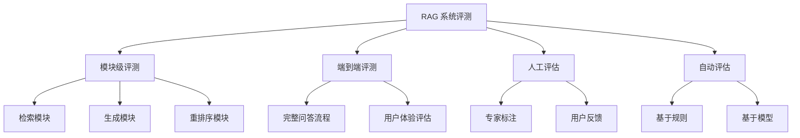

### 1.2 模块级 vs 端到端评测

| 评测类型 | 关注点 | 优点 | 缺点 |
|---------|--------|------|------|
| **模块级** | 各组件独立性能 | 定位问题快、可针对性优化 | 无法反映整体效果 |
| **端到端** | 最终问答质量 | 贴近真实场景、综合评估 | 问题归因困难 |

**最佳实践**：两者结合，模块级用于日常迭代优化，端到端用于发布前验证。

---

## 二、评测维度与常见指标

### 2.1 检索维度指标

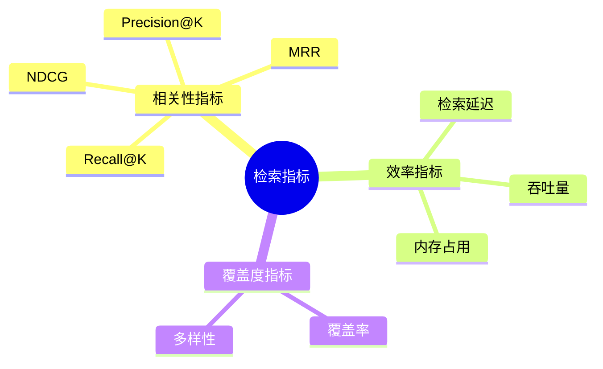

#### 核心指标详解

| 指标 | 公式/定义 | 适用场景 | 理想值 |
|------|----------|---------|--------|
| **Recall@K** | 前K个结果中相关文档数 / 总相关文档数 | 确保不遗漏关键信息 | > 0.8 |
| **Precision@K** | 前K个结果中相关文档数 / K | 确保返回结果质量 | > 0.6 |
| **MRR** | 第一个相关文档排名的倒数平均值 | 关注首位结果质量 | > 0.5 |
| **NDCG@K** | 考虑文档相关度分级的归一化折损累积增益 | 需要分级评估时 | > 0.7 |
| **Hit Rate@K** | 至少有一个相关文档在前K中的比例 | 快速评估召回能力 | > 0.9 |

**指标计算示例**：

```python
# Recall@K 计算
def recall_at_k(retrieved_docs, relevant_docs, k=5):
    """
    retrieved_docs: 检索返回的文档列表（按相关性排序）
    relevant_docs: 所有相关文档集合
    """
    retrieved_k = set(retrieved_docs[:k])
    relevant = set(relevant_docs)
    return len(retrieved_k & relevant) / len(relevant)

# 示例
retrieved = ["doc_A", "doc_B", "doc_C", "doc_D", "doc_E"]
relevant = ["doc_A", "doc_C", "doc_F"]  # 3个相关文档
recall_at_5 = 2 / 3  # doc_A 和 doc_C 被召回
```

### 2.2 生成维度指标

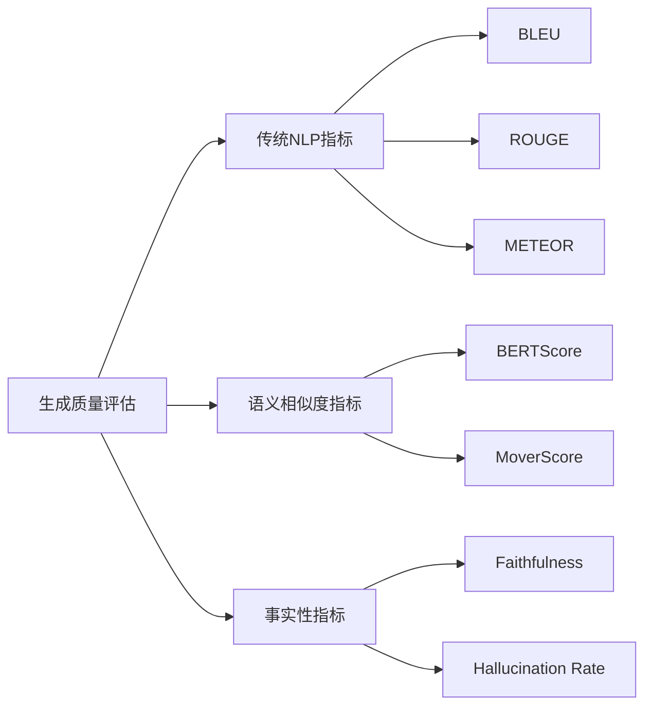

#### 生成指标对比

| 指标 | 类型 | 优点 | 缺点 |
|------|------|------|------|
| **BLEU** | N-gram匹配 | 计算快、标准化 | 不考虑语义 |
| **ROUGE** | 召回导向 | 适合长文本 | 忽略流畅度 |
| **BERTScore** | 语义嵌入 | 捕捉语义相似 | 计算成本高 |
| **Faithfulness** | 事实一致性 | 检测幻觉关键 | 需要参考文本 |

**BERTScore 计算原理**：

```python
from bert_score import score

# 候选答案与参考答案的语义相似度
candidates = ["RAG通过检索增强生成来提升回答质量"]
references = ["检索增强生成技术结合了信息检索和文本生成"]

P, R, F1 = score(candidates, references, lang="zh")
# P: 候选中多少词能被参考匹配
# R: 参考中多少词能被候选匹配
# F1: 综合指标
```

### 2.3 端到端指标

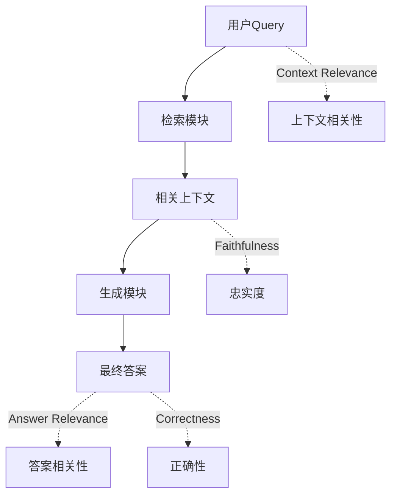

#### RAGAS 评估框架

[RAGAS](https://github.com/explodinggradients/ragas) 是专为 RAG 设计的评估框架：

| 指标 | 定义 | 计算方式 |
|------|------|---------|
| **Context Precision** | 检索到的上下文中相关块的比例 | 人工标注或模型判断 |
| **Context Recall** | 回答问题所需的上下文被检索到的比例 | 对比参考答案 |
| **Faithfulness** | 答案是否忠实于检索到的上下文 | 声称-证据匹配 |
| **Answer Relevancy** | 答案与问题的相关程度 | 问题-答案语义相似 |

```python
from ragas import evaluate
from ragas.metrics import faithfulness, answer_relevancy

# RAGAS 评估示例
result = evaluate(
    dataset=eval_dataset,
    metrics=[faithfulness, answer_relevancy]
)
```

---

## 三、评测数据集构成

### 3.1 数据集组成要素

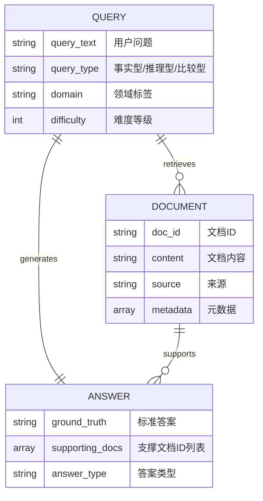

### 3.2 高质量数据集构建原则

| 维度 | 要求 | 示例 |
|------|------|------|
| **领域覆盖** | 覆盖目标业务场景 | 医疗、法律、金融、通用 |
| **难度分层** | 简单/中等/困难问题 | 单文档 vs 多文档推理 |
| **标注规范** | 明确的标注标准 | 相关性定义、答案完整性 |
| **负样本** | 包含干扰文档 | 相似但不相关的文档 |

**数据集格式示例**：

```json
{
  "query": "Transformer 中的注意力机制是如何工作的？",
  "query_type": "解释型",
  "domain": "NLP",
  "difficulty": "medium",
  "relevant_docs": ["doc_001", "doc_015"],
  "ground_truth": "注意力机制通过计算Query与Key的相似度，加权聚合Value...",
  "supporting_snippets": ["doc_001: 第3段", "doc_015: 第1段"]
}
```

---

## 四、RAG 优化策略

### 4.1 检索优化技术全景

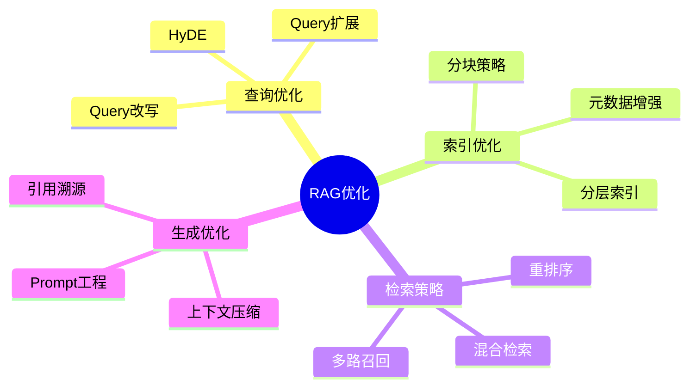

### 4.2 提升相关度的技术

#### 4.2.1 Query 改写与扩展

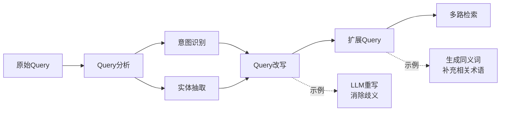

**常见 Query 增强方法**：

| 方法 | 原理 | 适用场景 |
|------|------|---------|
| **HyDE** | 用LLM生成假设答案，再向量化检索 | 复杂问题、语义鸿沟大 |
| **Query2Doc** | 生成伪文档扩展查询 | 短查询、关键词缺失 |
| **Pseudo-Relevance Feedback** | 用初检结果扩展查询 | 有初步检索结果时 |

**HyDE 实现示例**：

```python
# HyDE: Hypothetical Document Embeddings
def hyde_retrieval(query, vector_store, llm):
    # Step 1: 生成假设答案
    hypothetical_answer = llm.generate(
        f"基于你的知识，简要回答: {query}"
    )

    # Step 2: 用假设答案做检索
    docs = vector_store.similarity_search(
        query=hypothetical_answer,
        k=5
    )

    # Step 3: 用原始Query重排序（可选）
    reranked = rerank(query, docs)
    return reranked
```

#### 4.2.2 重排序（Reranker）

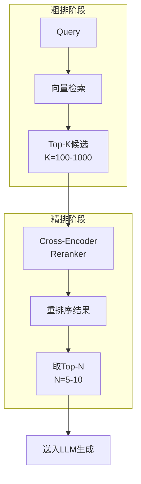

**Reranker 类型对比**：

| 类型 | 代表模型 | 优点 | 缺点 |
|------|---------|------|------|
| **Cross-Encoder** | BERT-based | 精度高 | 计算慢 |
| **ColBERT** | ColBERTv2 | 延迟-精度平衡 | 实现复杂 |
| **LLM-based** | GPT-4 | 理解能力强 | 成本高 |

**Reranker 使用示例**：

```python
from sentence_transformers import CrossEncoder

# 加载重排序模型
reranker = CrossEncoder('BAAI/bge-reranker-large')

# 候选文档
candidates = [
    "Transformer 使用自注意力机制处理序列",
    "BERT 是预训练语言模型",
    "注意力机制允许模型关注输入的不同部分"
]

# 重排序
pairs = [[query, doc] for doc in candidates]
scores = reranker.predict(pairs)

# 按分数排序
ranked = sorted(zip(candidates, scores), key=lambda x: x[1], reverse=True)
```

#### 4.2.3 混合检索

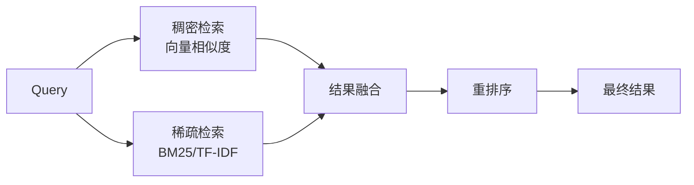

**融合策略**：

| 策略 | 公式 | 适用场景 |
|------|------|---------|
| **线性加权** | score = α·dense + (1-α)·sparse | 两种检索质量相近 |
| **Reciprocal Rank Fusion** | RRF(d) = Σ 1/(k + rank_i(d)) | 需要鲁棒融合 |
| **级联** | 先稀疏后稠密补充 | 稀疏检索召回高 |

### 4.3 优化回答效果

#### 4.3.1 分块策略优化

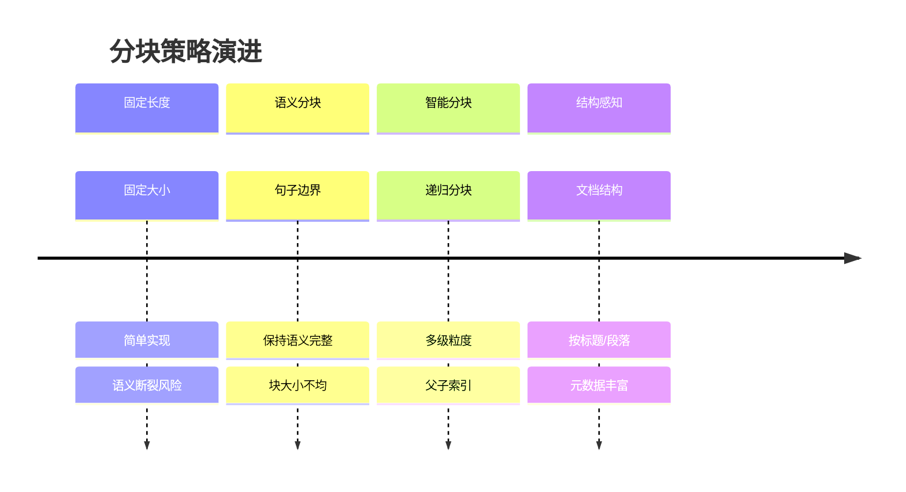

**分块策略对比**：

| 策略 | 块大小 | 优点 | 缺点 |
|------|--------|------|------|
| **Fixed** | 512 tokens | 简单、均匀 | 可能切断语义 |
| **Recursive** | 动态 | 多级粒度 | 实现复杂 |
| **Semantic** | 基于相似度 | 语义完整 | 块大小不均 |
| **Agentic** | LLM决定 | 智能切分 | 成本高 |

#### 4.3.2 上下文压缩

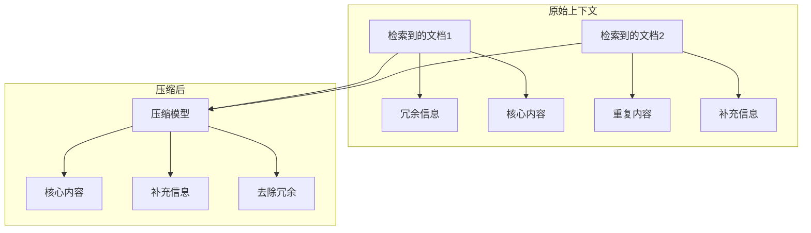

**上下文压缩技术**：

| 技术 | 原理 | 效果 |
|------|------|------|
| **Map-Reduce** | 逐文档摘要再合并 | 减少token数 |
| **Refine** | 迭代精炼答案 | 保持关键信息 |
| **Stuff** | 直接填充 | 简单但易超限 |
| **Contextual Compression** | 用LLM提取相关片段 | 精准压缩 |

**LangChain 上下文压缩示例**：

```python
from langchain.retrievers import ContextualCompressionRetriever
from langchain.retrievers.document_compressors import LLMChainExtractor

# 基础检索器
base_retriever = vectorstore.as_retriever(search_kwargs={"k": 10})

# 压缩器
compressor = LLMChainExtractor.from_llm(llm)

# 压缩检索器
compression_retriever = ContextualCompressionRetriever(
    base_compressor=compressor,
    base_retriever=base_retriever
)

# 检索并自动压缩
compressed_docs = compression_retriever.get_relevant_documents(query)
```

#### 4.3.3 Prompt 工程优化

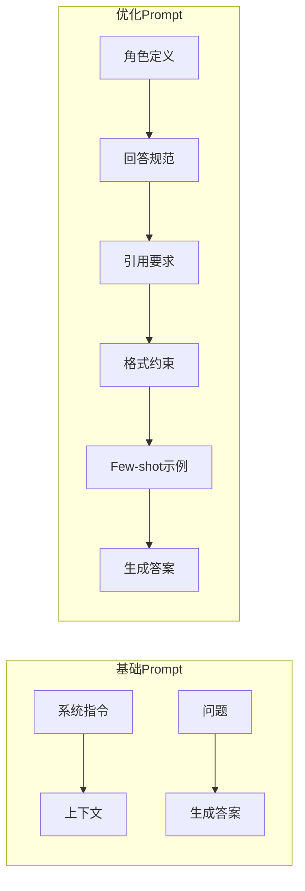

**RAG Prompt 模板**：

```markdown
## 角色
你是一个专业的知识问答助手，基于提供的参考资料回答用户问题。

## 任务
1. 仔细阅读参考资料
2. 仅基于参考资料回答问题
3. 如果资料不足以回答，明确说明"根据现有资料无法确定"

## 输出格式
- 直接给出答案
- 在答案后列出引用的文档编号 [doc_id]
- 保持简洁，避免冗余

## 参考资料
{context}

## 用户问题
{question}

## 回答
```

---

## 五、验证优化有效性

### 5.1 评估流程

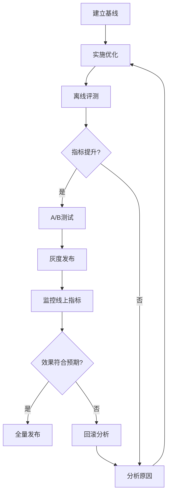

### 5.2 关键验证方法

| 方法 | 描述 | 适用阶段 |
|------|------|---------|
| **离线评测集** | 固定测试集对比指标 | 开发迭代 |
| **A/B测试** | 流量分组对比 | 发布前验证 |
| **人工抽检** | 专家评估回答质量 | 定期质检 |
| **用户反馈** | 点赞/点踩、追问率 | 线上监控 |

### 5.3 监控指标

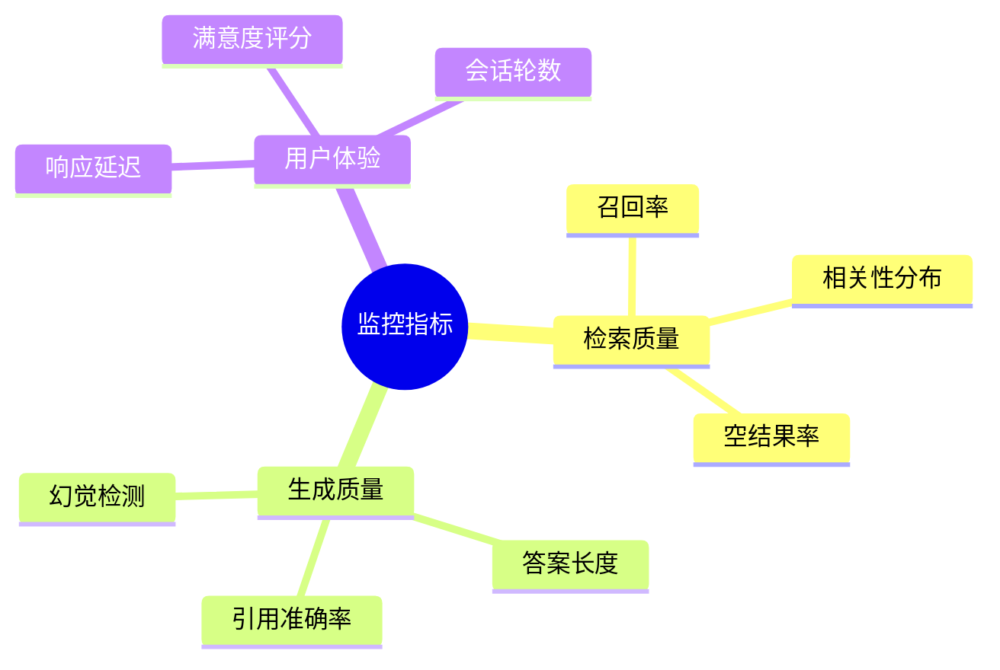

---

## 六、面试常见问题

### Q1: 如何设计一个 RAG 评测方案？

**答题要点**：
1. 明确评测目标（模块级 vs 端到端）
2. 构建评测数据集（领域覆盖、难度分层）
3. 选择合适指标（检索+生成+端到端）
4. 建立基线对比
5. 人工+自动评估结合

### Q2: 检索召回率高但生成质量差，如何排查？

**排查思路**：
1. 检查上下文是否包含答案（Precision问题）
2. 检查上下文噪声是否过多（需要压缩/过滤）
3. 检查Prompt是否引导得当
4. 检查LLM是否遵循指令（需要微调或换模型）

### Q3: 如何平衡检索延迟和效果？

**优化策略**：
1. 两阶段检索：粗排（向量）+ 精排（重排序）
2. 向量索引优化：HNSW参数调优、量化压缩
3. 缓存热门查询结果
4. 异步预检索

---

## 七、参考资源

- [RAGAS 文档](https://docs.ragas.io/)
- [LangChain RAG 教程](https://python.langchain.com/docs/use_cases/question_answering/)
- [Hugging Face RAG 最佳实践](https://huggingface.co/docs/transformers/model_doc/rag)
- [LlamaIndex 评估模块](https://docs.llamaindex.ai/en/latest/module_guides/evaluating/)
