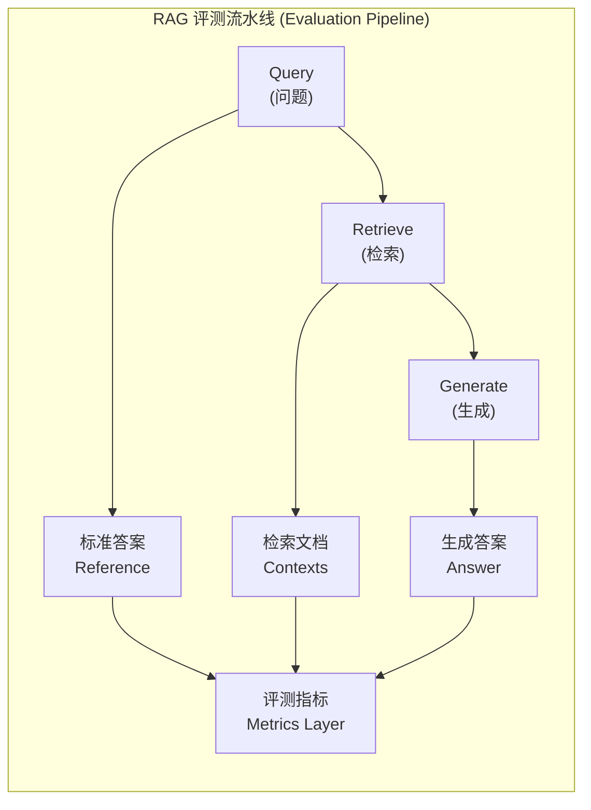
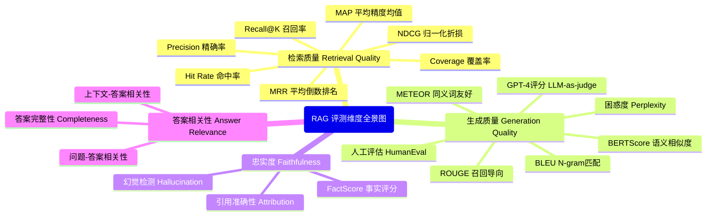
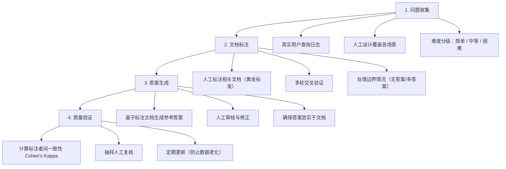
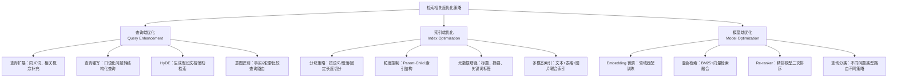
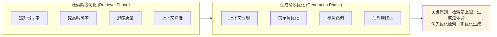
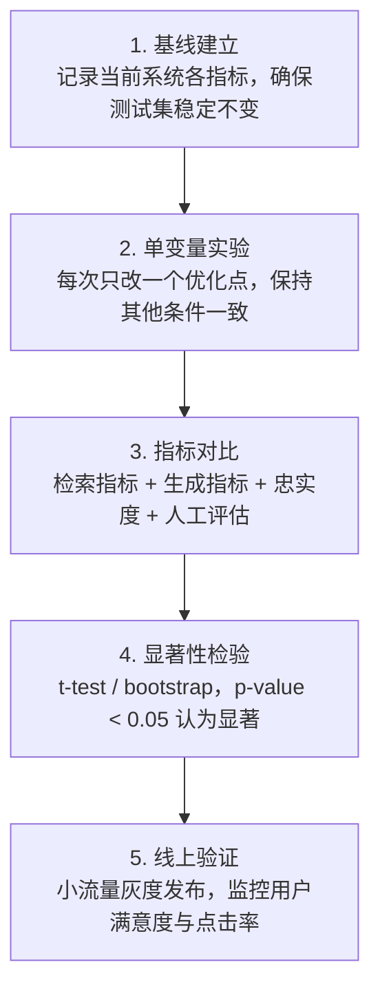

# RAG 系统评测与优化

## 一、RAG 系统如何评测？

### 1.1 评测层次



### 1.2 模块级 vs 端到端评测

| 评测类型 | 关注点 | 优点 | 缺点 |
|---------|--------|------|------|
| **模块级** | 各组件独立性能 | 定位问题快、可针对性优化 | 无法反映整体效果 |
| **端到端** | 最终问答质量 | 贴近真实场景、综合评估 | 问题归因困难 |

**最佳实践**：两者结合，模块级用于日常迭代优化，端到端用于发布前验证。

---

## 二、评测维度与常见指标

### 2.1 检索维度指标



#### 核心指标详解

| 指标 | 公式/定义 | 适用场景 | 理想值 |
|------|----------|---------|--------|
| **Recall@K** | 前K个结果中相关文档数 / 总相关文档数 | 确保不遗漏关键信息 | > 0.8 |
| **Precision@K** | 前K个结果中相关文档数 / K | 确保返回结果质量 | > 0.6 |
| **MRR** | 第一个相关文档排名的倒数平均值 | 关注首位结果质量 | > 0.5 |
| **NDCG@K** | 考虑文档相关度分级的归一化折损累积增益 | 需要分级评估时 | > 0.7 |
| **Hit Rate@K** | 至少有一个相关文档在前K中的比例 | 快速评估召回能力 | > 0.9 |

**指标计算公式**：

```
检索指标 (Retrieval Metrics)

Recall@K    = |{相关文档} ∩ {Top-K检索结果}| / |{相关文档}|

Precision@K = |{相关文档} ∩ {Top-K检索结果}| / K

MRR = (1/|Q|) × Σ(1/rank_i)
      其中 rank_i 是第i个查询的第一个相关文档的排名

NDCG@K = DCG@K / IDCG@K
DCG@K  = Σ(rel_i / log₂(i+1))  i从1到K
```

**Python 计算示例**：

```python
# Recall@K 计算
def recall_at_k(retrieved_docs, relevant_docs, k=5):
    """
    retrieved_docs: 检索返回的文档列表（按相关性排序）
    relevant_docs: 所有相关文档集合
    """
    retrieved_k = set(retrieved_docs[:k])
    relevant = set(relevant_docs)
    return len(retrieved_k & relevant) / len(relevant)

# 示例
retrieved = ["doc_A", "doc_B", "doc_C", "doc_D", "doc_E"]
relevant = ["doc_A", "doc_C", "doc_F"]  # 3个相关文档
recall_at_5 = 2 / 3  # doc_A 和 doc_C 被召回
```

### 2.2 生成维度指标

```
生成指标 (Generation Metrics)

BLEU = BP × exp(Σ w_n × log p_n)
       其中 p_n 是n-gram精确率，BP是简短惩罚

ROUGE-N = Σ(S∈References) Σ(gram_n∈S) Count_match(gram_n)
          ─────────────────────────────────────────────
          Σ(S∈References) Σ(gram_n∈S) Count(gram_n)

BERTScore F1 = 2 × (P × R) / (P + R)
               基于token embeddings的余弦相似度
```

#### 生成指标对比

| 指标 | 类型 | 优点 | 缺点 |
|------|------|------|------|
| **BLEU** | N-gram匹配 | 计算快、标准化 | 不考虑语义 |
| **ROUGE** | 召回导向 | 适合长文本 | 忽略流畅度 |
| **BERTScore** | 语义嵌入 | 捕捉语义相似 | 计算成本高 |
| **Faithfulness** | 事实一致性 | 检测幻觉关键 | 需要参考文本 |

**BERTScore 计算原理**：

```python
from bert_score import score

# 计算 BERTScore
P, R, F1 = score(candidates, references, lang='zh', device='cuda')
# P: Precision, R: Recall, F1: 综合得分
```

---

## 三、评测数据集内容

### 3.1 标准数据集组成

一个完整的 RAG 评测数据集通常包含：

| 组件 | 说明 | 示例 |
|------|------|------|
| **Queries** | 用户问题集合 | "RAG 系统如何评测？" |
| **Contexts** | 检索用的文档库 | 技术文档、论文、FAQ |
| **References** | 标准答案/参考答案 | 人工标注的理想回答 |
| **Relevant Docs** | 每个问题对应的相关文档 | doc_id 列表 |
| **Metadata** | 问题类型、难度、领域标签 | domain=tech, difficulty=hard |

### 3.2 构建高质量评测数据的方法



**关键原则**：
- **覆盖度**：涵盖各种查询类型（事实型、推理型、比较型）
- **真实性**：问题应贴近真实用户场景
- **可验证性**：答案必须能在文档中找到依据
- **难度分布**：简单:中等:困难 ≈ 3:5:2

---

## 四、RAG 优化策略

### 4.1 提升检索相关度的方法



**具体优化手段**：

| 优化点 | 方法 | 效果 |
|--------|------|------|
| 查询扩展 | 使用 LLM 生成同义词、相关词 | Recall ↑ 10-15% |
| HyDE | 生成假设答案文档再检索 | 语义匹配更准确 |
| 混合检索 | BM25 权重 0.3 + 向量 0.7 | 综合效果最优 |
| Re-ranker | Cross-encoder 精排 | Precision ↑ 20%+ |
| 分块优化 | 256-512 tokens 段落 | 平衡粒度与上下文 |

### 4.2 优化回答效果的思路

**优化阶段划分**：



**生成阶段具体优化**：

| 策略 | 方法 | 适用场景 |
|------|------|----------|
| 上下文压缩 | 使用 LLM 提取关键片段 | 检索文档过长 |
| 提示词工程 | Few-shot + 结构化指令 | 答案格式要求严格 |
| 引用生成 | 要求模型标注信息来源 | 需要可验证性 |
| 模型微调 | 领域数据 SFT | 特定领域专业回答 |
| 后处理过滤 | 事实一致性检查 | 幻觉敏感场景 |

### 4.3 验证优化有效性



**关键验证原则**：
- **指标全面**：不仅看自动指标，还要人工评估
- **统计显著**：确保提升不是随机波动
- **端到端验证**：模块级提升不一定带来整体提升
- **用户反馈**：最终看真实用户满意度

---

## 五、面试题速查表

### 5.1 RAG 评测与数据集

| 问题 | 核心要点 |
|------|----------|
| RAG 系统如何评测？ | 模块级 + 端到端，检索指标 + 生成指标 |
| 评测维度有哪些？ | 检索质量、生成质量、忠实度、答案相关性 |
| 常见指标有哪些？ | Recall@K、Precision@K、MRR、NDCG、BLEU、ROUGE、BERTScore |
| 评测数据集包括什么？ | Queries、Contexts、References、Relevant Docs、Metadata |
| 如何构建高质量数据？ | 真实问题收集、人工标注、交叉验证、质量检查 |

### 5.2 RAG 优化与效果提升

| 问题 | 核心要点 |
|------|----------|
| 如何提升相关度？ | 查询扩展、HyDE、混合检索、Re-ranker、Embedding 微调 |
| 优化回答效果的思路？ | 检索阶段优化（召回/排序）+ 生成阶段优化（提示/压缩/微调） |
| 优化哪个阶段？ | 优先检索阶段（决定上限），再生成阶段（决定体验） |
| 如何验证优化有效？ | A/B 测试、指标对比、显著性检验、线上灰度 |