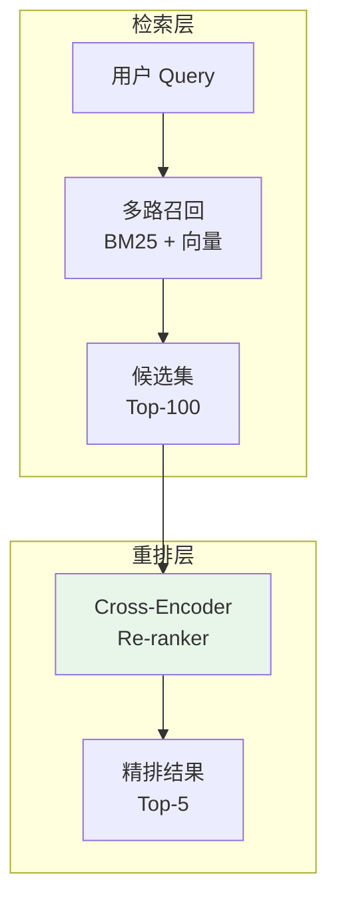
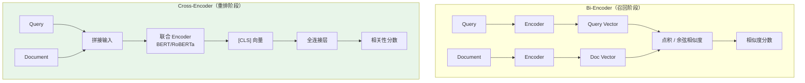
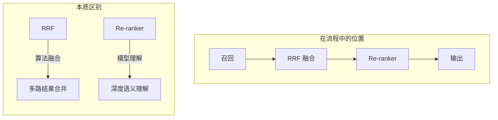
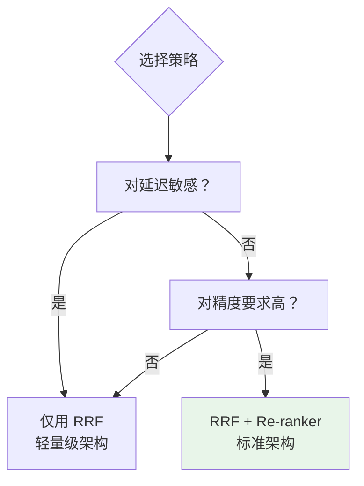
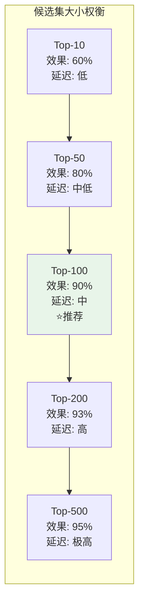
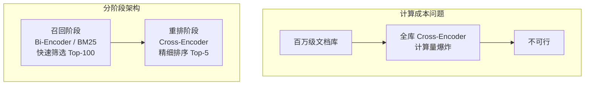
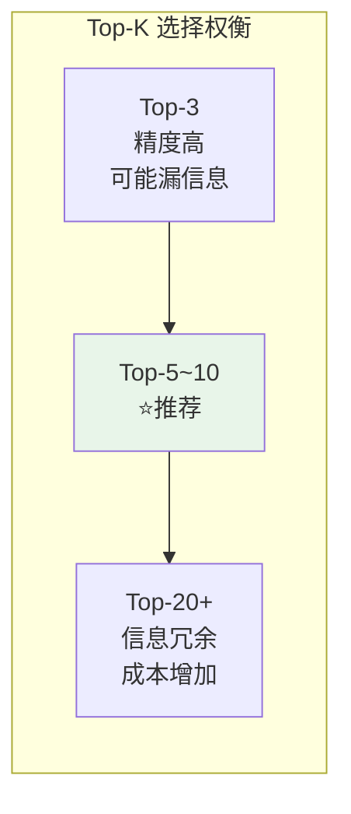

# Re-ranker 重排序模型

## 一、概念与原理

### 1.1 什么是 Re-ranker？

**Re-ranker（重排序模型）**是一种基于深度学习的精排技术，位于检索流程的**最后阶段**，对粗排后的候选文档进行精细化的相关性排序。



### 1.2 为什么需要 Re-ranker？

| 阶段 | 模型类型 | 特点 | 局限 |
|------|---------|------|------|
| **召回阶段** | Bi-Encoder（双编码器） | 速度快、可预计算 | Query-Doc 交互弱 |
| **重排阶段** | Cross-Encoder（交叉编码器） | 深度交互、精度高 | 计算成本高 |

**核心问题：召回阶段的 Embedding 模型是"分别编码"**

```java
// Bi-Encoder：Query 和 Doc 分别编码，点积计算相似度
float[] queryVec = embed("RAG 优化技巧");  // 独立编码
float[] docVec = embed("RAG 是一种结合检索和生成的技术...");  // 独立编码
similarity = cosineSimilarity(queryVec, docVec);  // 无交互

// 问题：无法捕捉细粒度的词级交互关系
// "优化"和"技术"的关联无法被精确建模
```

**Re-ranker 的解决方式：Cross-Encoder 联合编码**

```java
// Cross-Encoder：Query 和 Doc 一起输入，深度交互
String input = "[CLS] RAG 优化技巧 [SEP] RAG 是一种结合检索和生成的技术...";
double relevanceScore = crossEncoder.predict(input);  // 深度理解交互

// 优势：可以捕捉"优化"→"技术"的细粒度关联
```

---

## 二、技术原理详解

### 2.1 Bi-Encoder vs Cross-Encoder



| 特性 | Bi-Encoder | Cross-Encoder |
|------|-----------|---------------|
| **编码方式** | 分别独立编码 | 联合编码 |
| **交互深度** | 浅层（向量点积） | 深层（注意力机制） |
| **计算成本** | 低（可预计算 Doc 向量） | 高（每次都要前向传播） |
| **适用阶段** | 召回（候选集大） | 精排（候选集小） |
| **精度** | 中等 | 高 |

### 2.2 主流 Re-ranker 模型

| 模型 | 架构 | 特点 | 适用场景 |
|------|------|------|---------|
| **Cohere Rerank** | 商业 API | 效果优秀、开箱即用 | 快速上线、预算充足 |
| **BGE-Reranker** | 开源 | 中文友好、可微调 | 私有化部署 |
| **bge-reranker-v2-m3** | 开源轻量 | 体积小、速度快 | 资源受限环境 |
| **Jina Reranker** | 开源 | 多语言支持 | 国际化场景 |

---

## 三、面试题详解

### 题目 1：Re-ranker 和 RRF 有什么区别？什么时候用哪个？

#### 考察点
- 对重排层技术的理解
- 技术选型能力

#### 详细解答

**核心区别：**



| 维度 | RRF | Re-ranker |
|------|-----|-----------|
| **本质** | 融合算法 | 深度学习模型 |
| **输入** | 多路排名列表 | Query + Document 文本 |
| **是否理解语义** | ❌ 否 | ✅ 是 |
| **计算成本** | 极低 | 较高 |
| **解决什么问题** | 多路结果怎么合并 | 文档与 Query 的真实相关性 |

**使用场景：**



| 架构 | 流程 | 适用场景 |
|------|------|---------|
| **轻量级** | BM25 + 向量 → **RRF** → 输出 | 延迟敏感、成本受限 |
| **标准级** | BM25 + 向量 → RRF → **Re-ranker** → 输出 | 平衡效果与成本 |
| **高精度** | BM25 + 向量 → **Re-ranker** → 输出 | 候选集小、精度优先 |

---

### 题目 2：Re-ranker 的输入候选集一般多大？为什么？

#### 考察点
- 计算成本与效果的权衡
- 工程实践经验

#### 详细解答

**候选集大小的权衡：**

| 候选集大小 | 效果提升 | 相对延迟 |
|-----------|---------|---------|
| Top-10 | 60% | 10 |
| Top-50 | 80% | 30 |
| Top-100 | 90% | 60 |
| Top-200 | 93% | 120 |
| Top-500 | 95% | 300 |



**推荐配置：**

| 候选集大小 | 延迟 | 效果 | 适用场景 |
|-----------|------|------|---------|
| **Top-20** | 极低 | 中等 | 实时性要求极高 |
| **Top-50** | 低 | 良好 | 大多数场景 |
| **Top-100** | 中等 | 优秀 | 标准推荐 |
| **Top-200** | 较高 | 边际提升 | 精度敏感场景 |

**为什么是 Top-100？**

```java
// 计算成本分析
// 假设 Re-ranker 推理耗时 20ms/文档

// Top-20: 20 * 20ms = 400ms  ← 可能漏掉相关文档
// Top-100: 100 * 20ms = 2000ms  ← 平衡选择
// Top-500: 500 * 20ms = 10000ms  ← 延迟不可接受

// 经验：召回阶段 Top-100 的召回率通常已达 90%+
// 再增大候选集，Re-ranker 能带来的边际收益递减
```

**Java 实现示例：**

```java
/**
 * Re-ranker 服务
 */
public class ReRankerService {
    
    private final CrossEncoderModel rerankerModel;
    private final int rerankTopK = 100;  // 重排候选集大小
    private final int outputTopK = 5;    // 最终输出数量
    
    /**
     * 重排序流程
     */
    public List<ScoredDocument> rerank(String query, List<Document> candidates) {
        // 1. 截断候选集（控制计算成本）
        List<Document> truncated = candidates.stream()
            .limit(rerankTopK)
            .collect(Collectors.toList());
        
        // 2. 批量推理（实际应使用批处理优化）
        List<ScoredDocument> scored = new ArrayList<>();
        for (Document doc : truncated) {
            double score = rerankerModel.predict(query, doc.getContent());
            scored.add(new ScoredDocument(doc, score));
        }
        
        // 3. 按重排分数排序
        return scored.stream()
            .sorted(Comparator.comparing(ScoredDocument::getScore).reversed())
            .limit(outputTopK)
            .collect(Collectors.toList());
    }
}
```

---

### 题目 3：Re-ranker 可以替代向量检索吗？

#### 考察点
- 对检索架构的理解
- 技术边界认知

#### 详细解答

**不能替代，原因如下：**



**计算成本对比：**

| 方案 | 百万级文档库计算量 | 可行性 |
|------|-------------------|--------|
| **纯 Re-ranker** | 1,000,000 × 20ms = 20,000s ≈ **5.5小时** | ❌ 不可行 |
| **两阶段架构** | 预计算 + 100 × 20ms = **2s** | ✅ 可行 |

**正确的架构设计：**

```java
/**
 * 标准 RAG 检索流程
 */
public class RetrievalPipeline {
    
    // 第一阶段：召回（快速筛选）
    private final BiEncoder biEncoder;  // 向量检索
    private final BM25Retriever bm25;    // 关键词检索
    
    // 第二阶段：融合
    private final RRFFusion rrf;         // RRF 融合
    
    // 第三阶段：精排（深度理解）
    private final ReRanker reRanker;     // Cross-Encoder
    
    public List<Document> search(String query) {
        // 1. 多路召回（并行）
        List<Document> vectorResults = biEncoder.search(query, 100);
        List<Document> bm25Results = bm25.search(query, 100);
        
        // 2. RRF 融合
        List<Document> fused = rrf.fuse(vectorResults, bm25Results, 100);
        
        // 3. Re-ranker 精排
        return reRanker.rerank(query, fused, 5);
    }
}
```

**一句话总结：**
> Re-ranker 是"锦上添花"，不是"取而代之"。召回阶段负责"快速找可能相关的"，Re-ranker 负责"精确排最相关的"。

---

## 四、Re-ranker 后的 Top-K 选择

### 4.1 返回几个块？

**一般返回 Top-5 到 Top-10**

| 数量 | 适用场景 | 原因 |
|------|---------|------|
| **Top-3** | 事实型问答、单点查询 | 精准、低噪声 |
| **Top-5** | 标准场景、短答案 | 平衡精度与覆盖 |
| **Top-10** | 复杂推理、多跳问答 | 需要更多上下文支撑 |



**为什么是 5-10 而不是更多？**

- **太少（1-3）**：可能丢失关键信息，尤其多跳推理场景
- **适中（5-10）**：覆盖主要信息源，Token 成本可控
- **太多（15+）**：上下文膨胀，LLM 注意力分散，生成质量下降

### 4.2 验证方法

**离线验证：**

```java
/**
 * 评估不同 Top-K 的效果
 */
public Map<Integer, Metrics> evaluateTopK(List<TestCase> testCases, 
                                           int[] kValues) {
    Map<Integer, Metrics> results = new HashMap<>();
    
    for (int k : kValues) {
        int correct = 0;
        int totalTokens = 0;
        
        for (TestCase testCase : testCases) {
            // Re-ranker 重排
            List<ScoredDocument> reranked = reRanker.rerank(
                testCase.getQuery(), 
                testCase.getCandidates(), 
                100
            );
            
            // 取 Top-K
            List<Document> topK = reranked.stream()
                .limit(k)
                .map(ScoredDocument::getDocument)
                .collect(Collectors.toList());
            
            // 检查是否包含答案文档
            boolean hasAnswer = topK.stream()
                .anyMatch(doc -> testCase.getAnswerDocs().contains(doc.getId()));
            
            if (hasAnswer) correct++;
            totalTokens += topK.stream()
                .mapToInt(doc -> estimateTokens(doc.getContent()))
                .sum();
        }
        
        results.put(k, new Metrics(
            (double) correct / testCases.size(),  // Recall@K
            totalTokens / testCases.size()        // 平均 Token 数
        ));
    }
    
    return results;
}
```

**典型实验结果：**

| Top-K | Recall@K | 平均 Token | 边际收益 |
|-------|----------|-----------|---------|
| 3 | 75% | 800 | - |
| 5 | 88% | 1400 | +13% |
| 10 | 94% | 2800 | +6% |
| 15 | 96% | 4200 | +2% |
| 20 | 97% | 5600 | +1% |

**结论：** Top-5 到 Top-10 是性价比最高的区间

### 4.3 动态选择策略

**基于分数阈值：**

```java
public List<Document> adaptiveTopK(List<ScoredDocument> ranked, 
                                    double threshold) {
    List<Document> result = new ArrayList<>();
    
    for (int i = 0; i < ranked.size(); i++) {
        ScoredDocument doc = ranked.get(i);
        
        // 绝对阈值：分数过低直接丢弃
        if (doc.getScore() < 0.3) {
            break;
        }
        
        // 相对阈值：与第一名差距过大
        if (i > 0) {
            double gap = ranked.get(0).getScore() - doc.getScore();
            if (gap > threshold) {
                break;
            }
        }
        
        result.add(doc.getDocument());
    }
    
    return result;
}
```

**基于 Query 复杂度：**

```java
public int selectTopKByQuery(String query) {
    // 简单判断 Query 复杂度
    int wordCount = query.split("\\s+").length;
    boolean hasMultipleQuestions = query.contains("?") && 
                                   query.indexOf("?") != query.lastIndexOf("?");
    
    if (wordCount < 5 && !hasMultipleQuestions) {
        return 3;  // 简单问题
    } else if (hasMultipleQuestions || wordCount > 15) {
        return 10; // 复杂问题
    } else {
        return 5;  // 标准问题
    }
}
```

---

## 五、延伸追问

1. **"Re-ranker 的分数和向量相似度分数可以融合吗？"**
   - 可以，但通常 Re-ranker 分数已足够可靠，直接按它排序即可
   - 如需融合，建议加权求和，Re-ranker 权重应更高（如 0.7:0.3）

2. **"Re-ranker 模型如何微调？"**
   - 需要标注数据：(Query, Doc, RelevanceLabel) 三元组
   - 使用对比学习或 pointwise/pairwise 损失函数
   - 领域数据微调通常能提升 10-20% 的 NDCG

3. **"Re-ranker 和 LLM 做重排有什么区别？"**
   - Re-ranker：专门优化的轻量模型，速度快（毫秒级）
   - LLM：通用能力强但慢，可用于极端精度场景或作为标注工具
